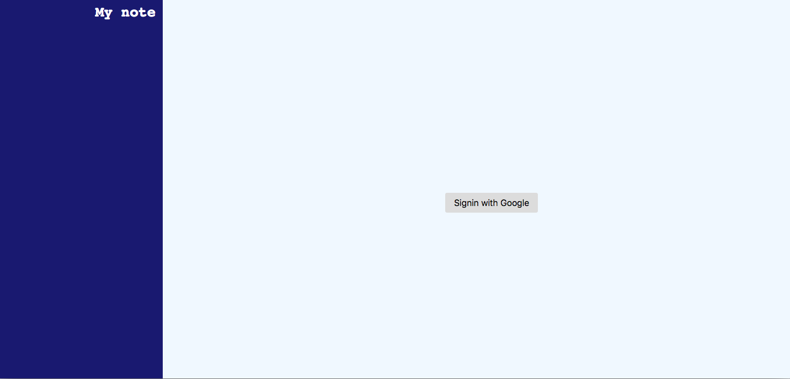

# myblog

"myblog" is a blog I created for front-end learning in Build@Mercari class.
Site : https://webmikikoichikawa.web.app

## How to use

### Login

When you access the site, you'll see the top screen as shown in this image.

"Sign in with Google" button with your Google account. Login.

### Add note

Click on the "+ New note" button.

Enter a title and body, then click the "Save" button.

The note has been added!

### Delete note

Click on the note you want to delete.

Confirm the content and click the "!Delete!" button.

The note will be deleted.

### Edit note

Click on the note you want to edit.

Edit the content and click the "Save" button.

The note has been updated.
